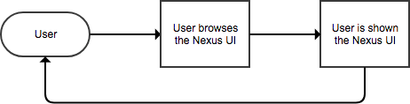
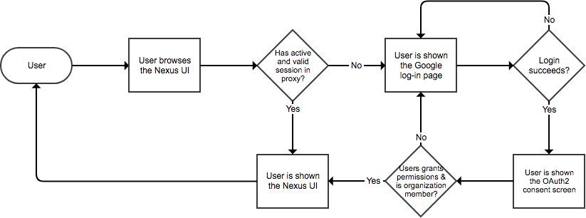
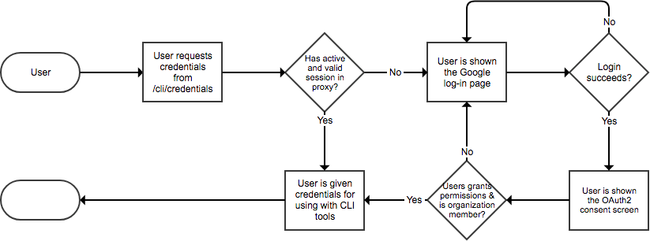
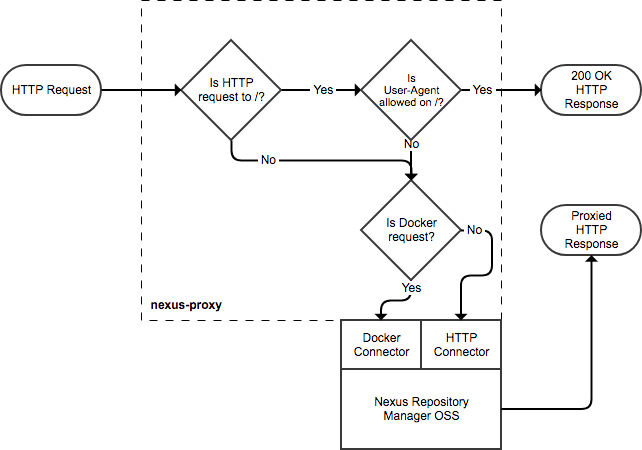
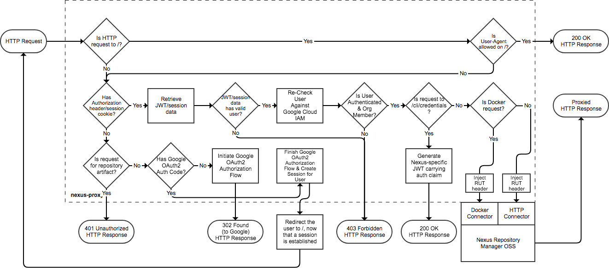

# Design of `nexus-proxy`

## Table of Contents

* [Introduction](#introduction)
* [External Flow](#external-flow)
  * [Authentication Disabled](#external-flow-authentication-disabled)
  * [Authentication Enabled](#external-flow-authentication-enabled)
    * [Browsing the Nexus UI](#external-flow-authentication-enabled-browsing-the-nexus-ui)
    * [Requesting Credentials for CLI Tools](#external-flow-authentication-enabled-requesting-credentials-for-cli-tools)
* [Internal Flow](#internal-flow)
  * [Authentication Disabled](#internal-flow-authentication-disabled)
  * [Authentication Enabled](#internal-flow-authentication-enabled)

## Introduction

When designing `nexus-proxy` we knew we had to support both browser-based and
CLI-based flows (e.g., browsing the Nexus UI and using tools such as Maven or
Docker to upload/download artifacts). We also knew beforehand that we would need
to authenticate Nexus against
[Google Cloud Identity & Access Management](https://cloud.google.com/iam/), but
we wanted to make this authentication optional so that `nexus-proxy` could be
used in simpler scenarios.

This document details both the external (i.e., from the perspective of the user)
and internal flows of `nexus-proxy`, detailing what happens in each flow when
authentication is disabled and enabled. For simplicity we assume that
`nexus-proxy` is reachable at https://nexus.example.com.

## External Flow

### Authentication Disabled

When authentication is disabled `nexus-proxy` is transparent to the user. The
following flowchart details a user's experience when browsing
https://nexus.example.com:

  

### Authentication Enabled

When authentication is enabled, `nexus-proxy` requires that one authenticates
themselves against Google Cloud IAM.

#### Browsing the Nexus UI

The following flowchart details a user's experience when browsing
https://nexus.example.com:

  

#### Requesting Credentials for CLI Tools

In order to use tools such as Maven or Docker, one must obtain a specific set of
credentials. This is necessary so that one doesn't have to use their Google
organization credentials or a manually-obtained Google authentication token in
their configuration files. The credentials generated by `nexus-proxy` are JWT
tokens and are valid for one year (unless organization membership is revoked
before this period).

The following flowchart details a user's experience when visiting https://nexus.example.com/cli/credentials:

  

One must then configure their tools to use these credentials. Detailed steps can
be found
[here](https://github.com/travelaudience/kubernetes-nexus/tree/master/docs/usage).

## Internal Flow

### Authentication Disabled

When authentication is disabled, `nexus-proxy` proxies requests to Nexus and
responds to health-checks on its behalf. An health-check is any HTTP request
made to `/` by user-agents matching a configurable regular expression. These
must usually be responded with `200 OK`, and `nexus-proxy` ensures that.

The following flowchart details the flow of an HTTP request made to
`nexus-proxy` when authentication is disabled:

  

### Authentication Enabled

When authentication is enabled, `nexus-proxy` performs the following high-level
tasks:

* Responds to health-checks as described
  [above](#internal-flow-authentication-disabled).
* Performs an OAuth2 "_authorization code_" flow in order to establish a
  session.
* Ensure that only authenticated users can access protected resources in both
  in-browser and CLI flows.
* Partially implements the authentication flows of Maven and Docker
  repositories.

This last item is necessary because Maven and Docker expect HTTP Basic
authentication (as opposed to the Bearer Token/JWT authentication which we are
using). Also, Docker expects specific response headers at a specific endpoint,
according to the
[Docker Registry HTTP API V2](https://docs.docker.com/registry/spec/api/). As
such, and since `nexus-proxy` stands between Maven/Docker and Nexus, this part
of the authentication flow had to be implemented in the proxy.

The following flowchart details the flow of an HTTP request made to
`nexus-proxy` when authentication is enabled:

  

